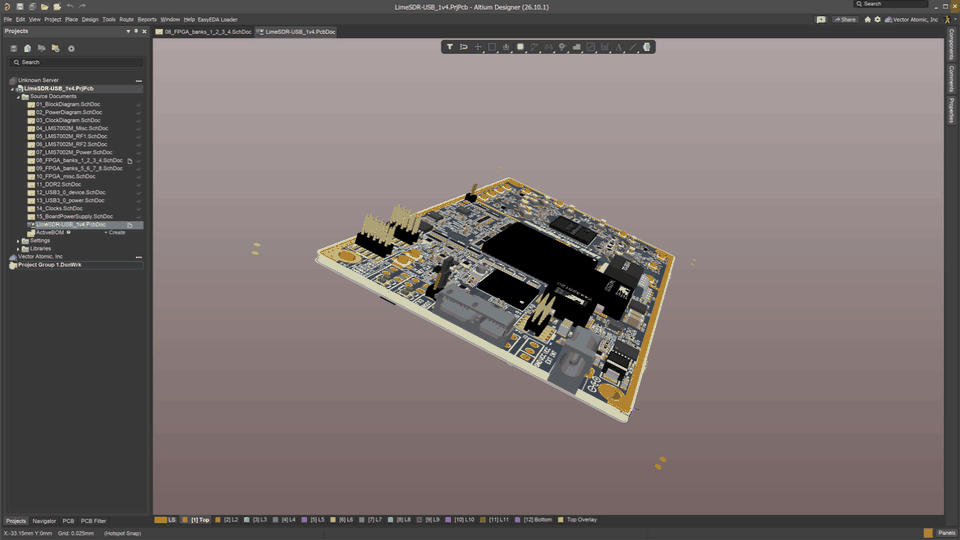
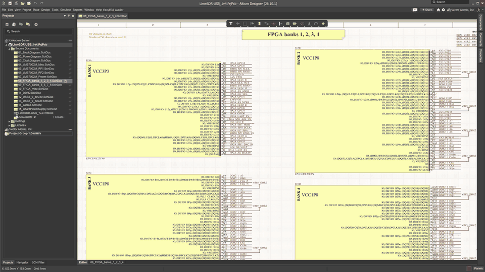
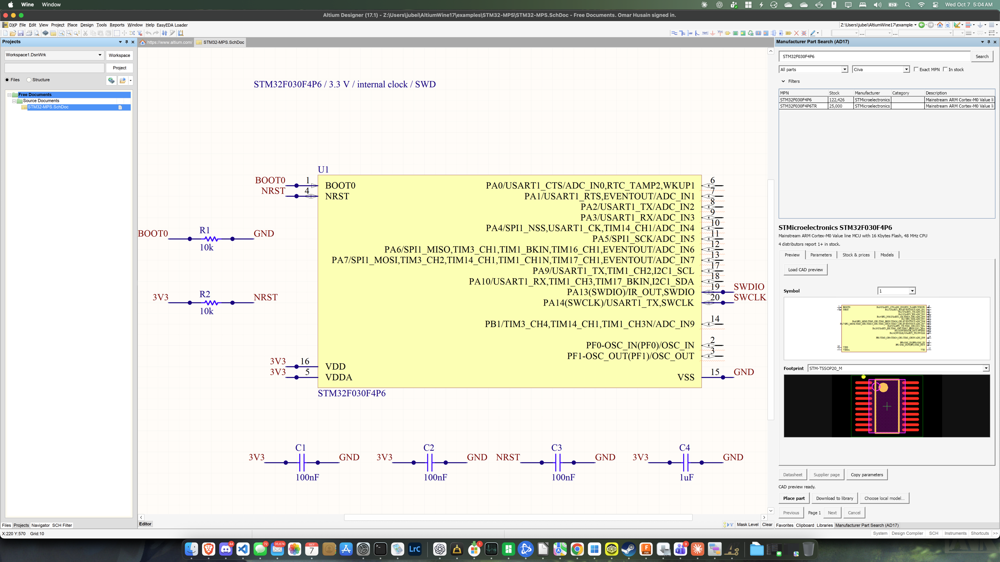

# Altium Designer on macOS with Wine

Run Altium Designer on Apple Silicon Macs with patched Wine. Tested with Altium Designer 17.1 and 26.10.1 on an M4 Mac running macOS 15.7.9.

Altium 365 works, including project cloning.



*[LimeSDR-USB](docs/screenshots/README.md) by [Lime Microsystems / Myriad-RF](https://github.com/myriadrf/LimeSDR-USB).*

## Install

Get the Altium offline installer from your Altium account, then download and run the [kit installer](https://github.com/lazy-jubei/altium-wine/releases/tag/v1.1.1):

```bash
curl -fL https://github.com/lazy-jubei/altium-wine/releases/download/v1.1.1/install.sh -o install.sh
bash install.sh
```

To choose your offline setup folder or ZIP:

```bash
bash install.sh --altium-installer /path/to/offline-setup
```

The installer sets up Wine and fonts and creates `~/Applications/Altium Designer (Wine).app`. It uses prebuilt Wine modules, so Xcode and Homebrew aren't required. Rosetta 2 is required.

Optimizations include:

- Cached Direct2D state, glyphs and geometry for faster schematics.
- Matched color spaces, parallel copies and native AD17 pan compositing.
- Queued Direct3D uploads for faster AD17 PCB views.
- Fixes for hidden dialogs, floating panels, tooltip input and Vault freezes.

For faster AD17 3D panning, disable **Use Ordered Blending in 3D** in **Preferences → PCB Editor → Display**. [Tuning details](docs/technical-notes.md).

Wine and Altium live in `~/AltiumWine`. Re-run `install.sh` to update.

[Setup and sign-in guide](docs/setup.md) · [Patch details and troubleshooting](docs/technical-notes.md)

## Screenshots

**PCB View**


**Schematic view**



**Altium 17**



## Build

Requires Rosetta 2, Xcode Command Line Tools and Homebrew. Allow about 3 GB of disk space and 15 minutes for the first build.

```bash
git clone https://github.com/lazy-jubei/altium-wine.git
cd altium-wine
bash install.sh --build-from-source --altium-installer /path/to/offline-setup
```

The build patches Wine 11.16 for rendering, Rosetta, dialogs, networking and AD17 startup. Output: `~/AltiumWine/wine-patched`.

To rebuild and export the modules with checksums:

```bash
bash build-patched-wine.sh --export ~/AltiumWine/build/modules-export
```
