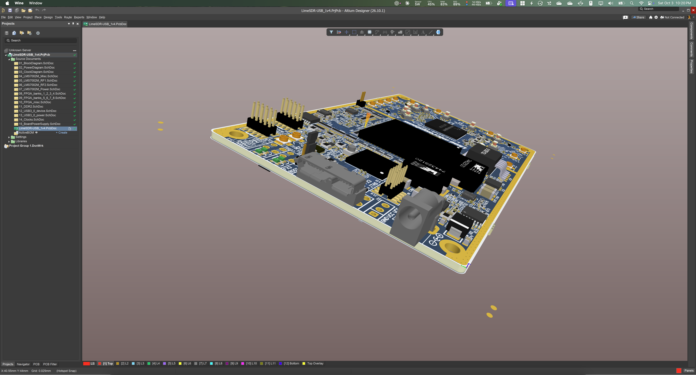
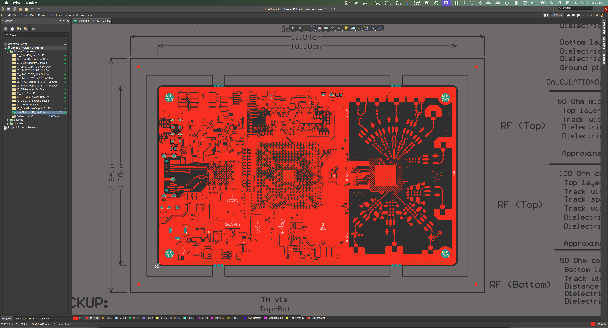
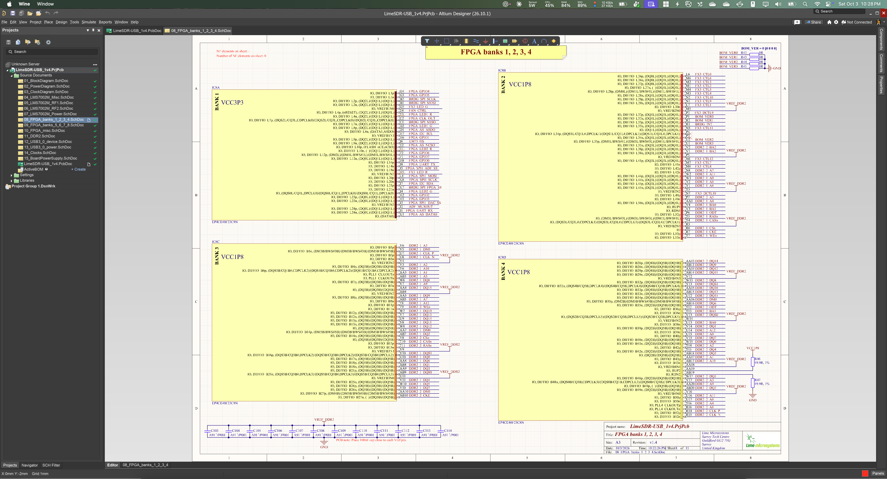

# Altium Designer on macOS with Wine

Run Altium Designer on Apple Silicon Macs with patched Wine. Tested with Altium 26.10.1 on an M4 Mac running macOS 15.7.9.



*[LimeSDR-USB](docs/screenshots/README.md) by [Lime Microsystems / Myriad-RF](https://github.com/myriadrf/LimeSDR-USB).*

## Install

Get the Altium offline installer from your Altium account, then download and run the [kit installer](https://github.com/lazy-jubei/altium-wine/releases/tag/v1.0.0):

```bash
curl -fL https://github.com/lazy-jubei/altium-wine/releases/download/v1.0.0/install.sh -o install.sh
bash install.sh
```

To choose your offline setup folder or ZIP:

```bash
bash install.sh --altium-installer /path/to/offline-setup
```

The installer sets up Wine and fonts and creates `~/Applications/Altium Designer (Wine).app`. It uses prebuilt Wine modules, so Xcode and Homebrew aren't required. Rosetta 2 is required.

Wine and Altium live in `~/AltiumWine`. Re-run `install.sh` to update.

[Setup and sign-in guide](docs/setup.md) · [Patch details and troubleshooting](docs/technical-notes.md)

## Screenshots

**PCB View**



**Schematic view**



## Build

Requires Rosetta 2, Xcode Command Line Tools and Homebrew. Allow about 3 GB of disk space and 15 minutes for the first build.

```bash
git clone https://github.com/lazy-jubei/altium-wine.git
cd altium-wine
bash install.sh --build-from-source --altium-installer /path/to/offline-setup
```

The build compiles three Wine 11.16 modules and applies two binary patches. The patched bundle is saved in `~/AltiumWine/wine-patched`.

| Module | Fix |
|---|---|
| `wow64cpu.dll` | Rosetta installer crashes |
| `user32.dll` | Menu crashes from a missing API |
| `winhttp.dll` | Altium 365 cloning timeouts |
| `winemac.so` | Overlapping document views |
| `d2d1.dll` | Slow schematic redraws |

To rebuild and export the modules with checksums:

```bash
bash build-patched-wine.sh --export ~/AltiumWine/build/modules-export
```
